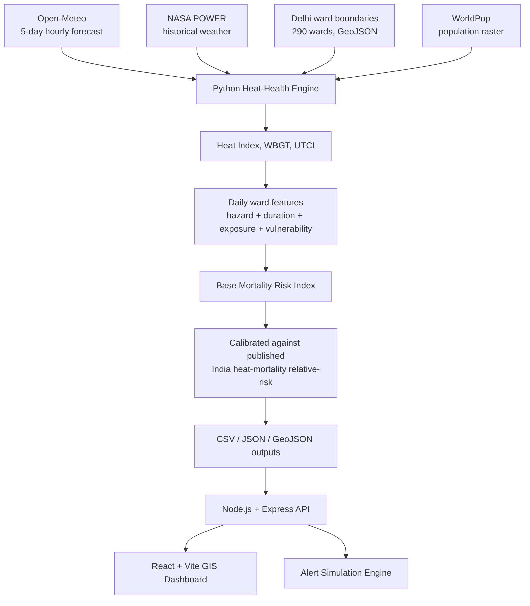

# Delhi Heat-Health Command Centre

A geospatial early-warning system that forecasts heat-related health risk across all 290 of Delhi's wards. It fuses live weather forecasts, thermal-comfort science, ward-level demographic vulnerability, and population exposure into a calibrated Mortality Risk Index — then serves it through an API and an interactive GIS dashboard with a simulated alert-dispatch workflow.

**Live demo:** https://heat-health-engine-five.vercel.app


## How it works



**Deployment:** the Python pipeline runs offline and commits its outputs to `models/` and `output/`; the Express API is deployed on **Render** and the React dashboard on **Vercel**, both built from this GitHub repo.

## Mortality Risk Index

Each ward-day is scored 0–100 from four inputs — thermal hazard (HI/WBGT/UTCI), exposure (population and density), duration (consecutive dangerous days), and demographic vulnerability — then calibrated against a published India heat-mortality relative-risk coefficient.

> **Note:** the Mortality Risk Index is currently a relative heat-health impact score, not a predicted number of deaths.

| Risk index | Category | Response |
|---|---|---|
| 0–24 | Low | Routine monitoring |
| 25–49 | Moderate | Public advisory |
| 50–74 | High | Heat action plan — open cooling centres, shift outdoor work |
| 75–100 | Extreme | Emergency response — hospital surge alert, regional alerts, work suspension |

High/Extreme wards flow into the alert engine, which simulates SMS/WhatsApp dispatch and writes an audit log (`output/alert_dispatch_log.jsonl`).

## Architecture

```
data/                    Raw inputs — ward boundaries, population raster, demo demographics, sample weather
heat_health/             Python pipeline (weather → thermal indices → risk → calibration → GIS outputs)
models/                  Fitted mortality calibration model (JSON)
output/                  Generated forecasts, risk maps, hotspots, and pipeline/summary reports
backend/                 Express API serving the generated outputs
frontend/                React + Vite dashboard (map, ward forecast charts, alert panel)
tests/                   Pytest suite for the pipeline and calibration logic
docs/screenshots/        Dashboard screenshots used in this README
```

### Pipeline stages (`heat_health/forecast_pipeline.py`)

| Step | Module | Network? | Key output |
|---|---|---|---|
| 1. Download ward-level weather forecast | `ward_forecast` (Open-Meteo) | Yes | `delhi_ward_hourly_forecast.csv` |
| 2. Calculate hourly thermal indices | `forecast_thermal` | No | `delhi_ward_hourly_thermal_forecast.csv` |
| 3. Generate daily ward risk forecast | `daily_risk_forecast` | No | `delhi_ward_daily_risk_forecast.csv`, `delhi_5day_peak_risk_map.geojson` |
| 4. Apply mortality-risk calibration | `mortality_calibration` | No | `delhi_ward_daily_calibrated_risk.csv` |
| 5. Generate calibrated GIS products | `calibrated_map` | No | `delhi_5day_peak_calibrated_risk_map.geojson`, `delhi_calibrated_hotspots.csv` |

This produces 290 wards × 5 days = **1,450 ward-day predictions** per run.

Supporting modules: `spatial_setup.py` (clean/process raw ward GeoJSON), `population_exposure.py` (WorldPop raster ↔ ward intersection), `ward_vulnerability.py` (demographic scoring), `nasa_power.py` (historical weather download), `historical_backtest.py` (validates the model against the May 2024 Delhi heatwave — 30 days tested, published warnings compared day-by-day), `system_check.py` (end-to-end health check of the generated outputs).

## Dashboard

The **Delhi Heat-Health Command Centre** surfaces the pipeline output as a live GIS view — an overview with current max risk, wards monitored, forecast horizon, and model status; an interactive daily/5-day-peak risk map; a five-day ward risk distribution; historical validation against the May 2024 heatwave; and a ranked table of the highest-risk wards.


## Tech stack

- **Data/ML pipeline:** Python — `pandas`, `numpy`, `geopandas`, `rasterio`, `pythermalcomfort`
- **Backend:** Node.js — `express`, `helmet`, `cors`, `express-rate-limit`, `morgan`, `csv-parse`
- **Frontend:** React + Vite, Leaflet (map rendering)
- **Tests:** `pytest`

## Getting started

### Prerequisites
- Python 3.10+
- Node.js 18+

### 1. Set up the Python pipeline
```bash
pip install -r requirements.txt
```

### 2. Run the pipeline
```bash
# One-off: process a static weather CSV into thermal indices
python -m heat_health.pipeline --input data/delhi_weather_may_2024.csv --output output/delhi_hourly_thermal_indices.csv

# Full forecast pipeline (fetch weather → thermal indices → risk → calibration → GIS outputs)
python -m heat_health.forecast_pipeline

# Skip the network fetch and reuse the existing ward weather forecast
python -m heat_health.forecast_pipeline --skip-fetch

# Verify the generated outputs are consistent
python -m heat_health.system_check
```

### 3. Run the backend API
```bash
cd backend
npm install
npm run dev   # or: npm start
```
The API reads directly from `models/` and `output/`, so run the pipeline at least once first. Configure `PORT` and `CORS_ORIGIN` via a `.env` file (see `.gitignore` — `.env` is not committed).

Key endpoints:
- `GET /api/health` — status of all backing data files
- `GET /api/model` — mortality calibration model
- `GET /api/summary` — combined mortality/map/backtest summary
- `GET /api/forecast/daily` — daily ward-level forecast rows
- `GET /api/map` — calibrated 5-day peak risk GeoJSON
- `GET /api/wards` / `GET /api/wards/:wardId` — ward-level risk (filterable by `risk_level`)
- `GET /api/hotspots` — top-N highest-risk wards
- `GET /api/alerts/preview` — preview an alert for a ward/date
- `POST /api/alerts/dispatch` — simulate dispatching an alert

### 4. Run the frontend
```bash
cd frontend
npm install
npm run dev
```
Set `VITE_API_BASE_URL` in a `.env` file if the backend isn't on the default local port.

### 5. Run tests
```bash
pytest
```

## Data sources

- Weather forecast: [Open-Meteo](https://open-meteo.com/)
- Historical weather: [NASA POWER API](https://power.larc.nasa.gov/)
- Ward boundaries: [Bharatlas Delhi wards dataset](https://bharatlas.com/view/wards_delhi) (CC-BY-SA-4.0)
- Population: [WorldPop](https://hub.worldpop.org/geodata/summary?id=41746) 1km density raster, reprojected to 100m (CC-BY-4.0)
